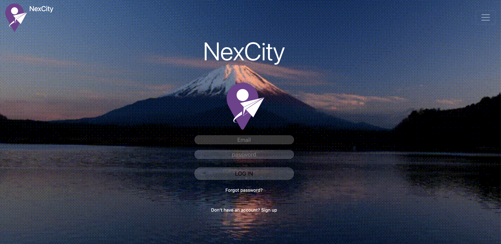
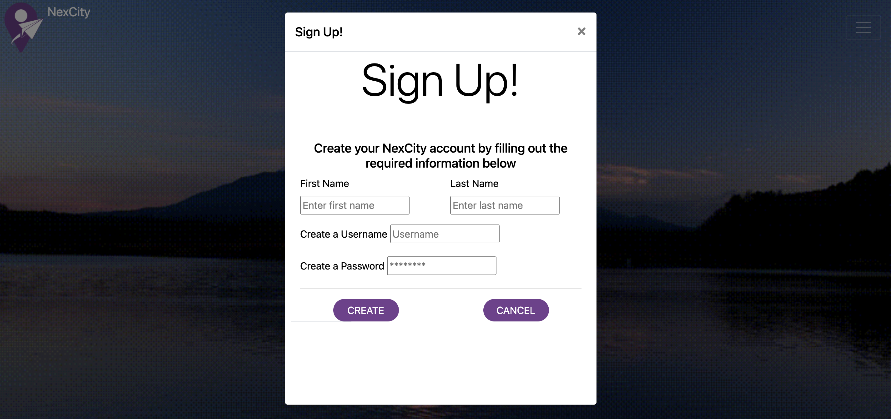
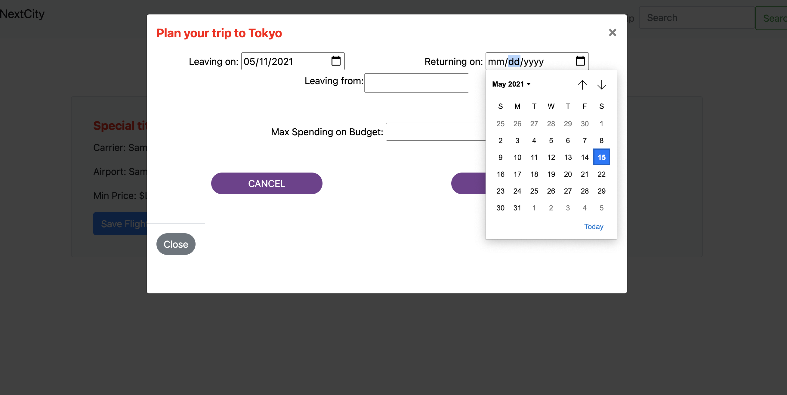
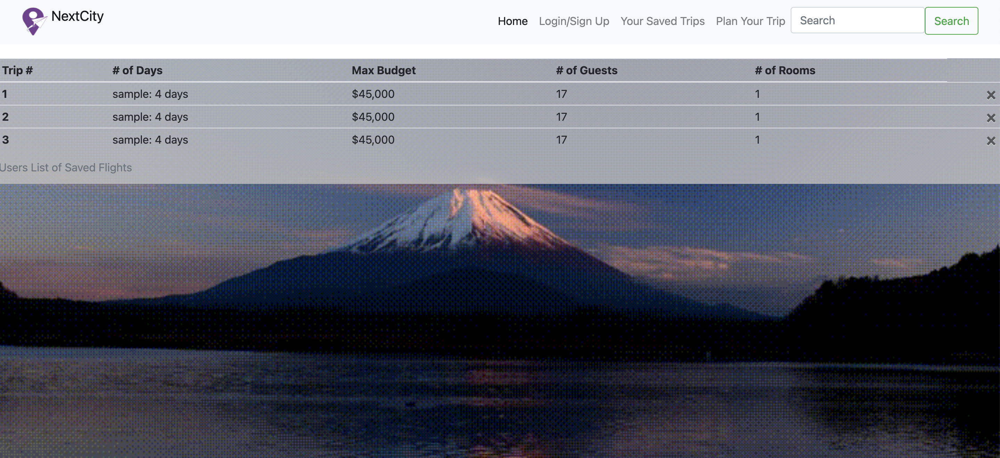

# # NexCity: The Travel app that puts the fun back into travelling

Are you easily stressed when planning trips or vacations? Tired of sifting through multiple flights and hotel deals? Wish there was someone or something that could do it all for you? Then look no further, NexCity is the solution to all your trip planning woes.
This app is designed to take all your desired requests for your ideal trip, and based on your requests, produce multiple options of affordable trips that meets the users’ requirements.
The app will also allow the user to save their favorite trips so they can review their selection anytime they want.

## The Concept

In the past year we’ve seen the decline of travel due to the covid-19 pandemic. Now that travel restrictions are loosening, people are ready to start travelling again. We saw this renewed  burgeoning desire to travel as an opportunity to create an app that could really cater to the travellers needs based on the city they would like to visit.
Currently the app focuses on creating the ideal vacation for any person seeking to travel to Tokyo. Ideally, the app will provide, flights, hotels and different attractions of the city.

## User Story:
As a travel enthusiast, who is excited that the world is now opening up again and people are able to travel, I want to find an app that can help me plan my next big trip to Tokyo based on my budget so that I can plan the most affordable trip.

## Installation and Technologies

For the app installation, one must ensure that they have installed all the dependencies. These are as follows:
* `mysql`
* `msyql2`
* `sequelize`
* `express`
* `axios`
* `passport`

Once these are installed, one must ensure that the start script is included in the `package.json`.

Other things to check for:
* ensure `.env` file has the users msql password
* ensure `.env` , `node_modules` and any other private info is hidden in the `.gitignore` file.

After this, the user must sign into mysql using the command line and then run `npm start`.

## Usage

When a user visits the app, they are greeted by the homepage that explains what services the app offers. The user will see a carousel that shows many sites of Tokyo. At the Navbar, the user has the option to login or sign up.

Upon clicking the login button, the user is brought to a new page, that gives the user the option to sign up or login. 

Once the user is logged in, they are returned to the homepage and can then select the plan trip button. This will produce a modal with questions pertaining to the trip. After the user completes the form, the modal closes and the users trip options are produced.

The user is then given the option save the trips that they like.

## Challenges

Unfortunately, the app does not quite function as we hoped. The api, which was once working, is no longer producing any results.

In addition the login and sign up option is also not functioning the way we intended. 

These are things I intend on revisiting.

## Links

To review the code, please visit the repo below:
* [NexCity Repo](https://github.com/crystal-g-b/NexCity)

To view the deployed website:

* [NexCity](https://desolate-shore-11113.herokuapp.com/)

